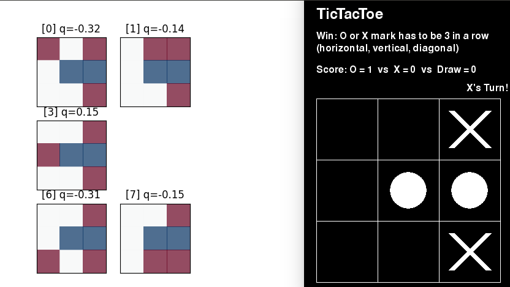

# mcts-tic-tac-toe
https://github.com/hayoung-kim/mcts-tic-tac-toe

solve tic tac toe (3x3) problem using vanila `mcts`. It was made for the purpose of studying the concept of mcts. 



youtube demo: https://youtu.be/9BEcOWviCjA

### Requirement

- pygame


### How to play

```
python play.py
```


### Implement detail

`selection`: UCT algorithm (https://en.wikipedia.org/wiki/Monte_Carlo_tree_search)

`expansion`: create all possible node from state

`simulation`: randomly play simulation(=random roll-out policy). This simulation method lower the performance. 

`backprop`: back propagate simulation result. 


## References

http://tim.hibal.org/blog/alpha-zero-how-and-why-it-works/

https://medium.com/swlh/tic-tac-toe-at-the-monte-carlo-a5e0394c7bc2

https://github.com/reinforcement-learning-kr/alpha_omok

https://github.com/JuliaPOMDP/MCTS.jl


## Acknowledgement

[Kyushik Min](https://github.com/Kyushik) helped a lot for implementing algorithm.